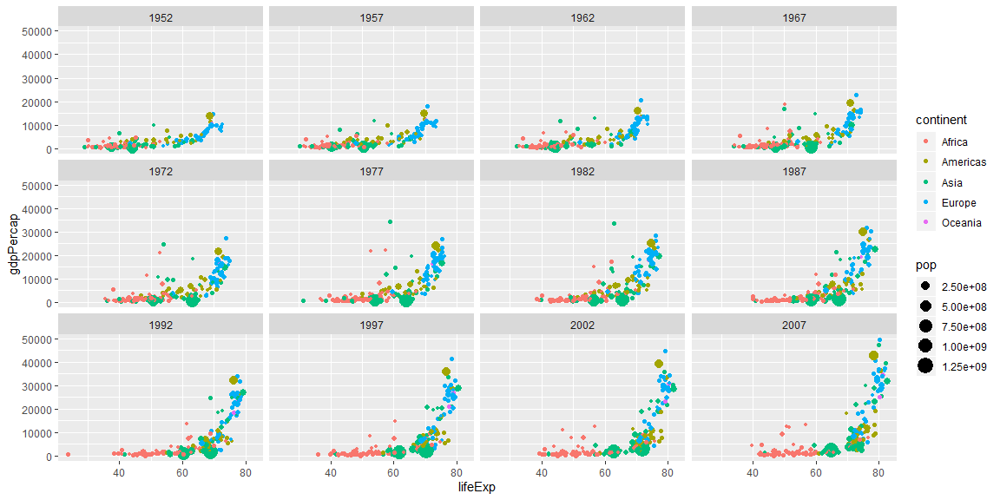
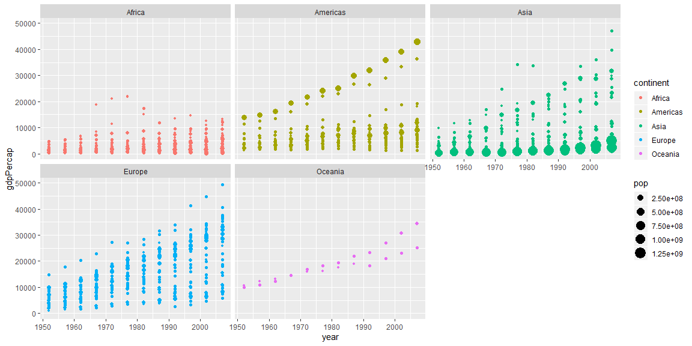

## Background
I've never usesd ggplot and this is a new game for me. I really like what we have done so far. I feel like I'll be able to make more happen with the data we are given. I'm still stuck, and don't quite the part about the GDP mean and the weighted.mean() portion. I'm still not sure why my github things are working either and will be asking about that to Bro. Palmer. I like how this is so stright forward and is easy to manipulate the graphs. For example you can say size= some variable from the data set and it seems to make pretty good sense. 

##Images

### Scatter Plot


```r
ggplot(gapminder1, mapping=aes(x=lifeExp, y=gdpPercap,
                               size=pop,
                               color=continent,
                               scale_y_continuous(trans = "sqrt")))+
  geom_point()+
  facet_wrap(~year)
```

<!-- -->


### Line Plot


```r
ggplot(gapminder1, mapping=aes(x=year,y=gdpPercap, 
                               size=pop,
                               color=continent,
                               scale_y_continuous(trans = "sqrt"),
                              ))+
  geom_point()+
  facet_wrap(~continent)
```

<!-- -->
